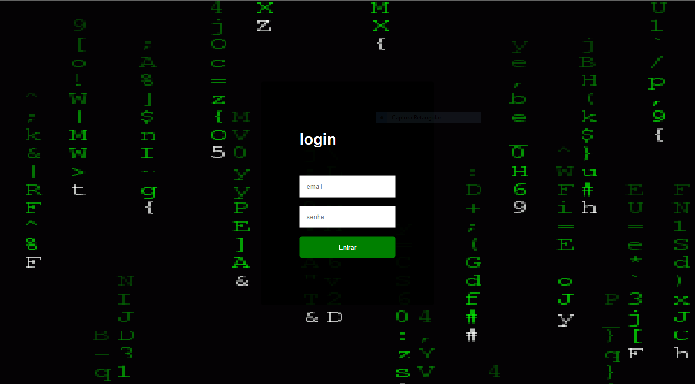

# Página de login web site

## Captura

## Sobre

Esta é uma página de login web site simples criada com HTML, CSS e JavaScript. Esta página não é afiliada ao GitHub, é apenas um exercício para praticar habilidades de front-end.

## Funcionalidades

- Verificação de campos obrigatórios
- Validação de email
- Validação de senha (mínimo de 8 caracteres)
- Exibição de mensagem de erro caso as credenciais estejam incorretas

## Tecnologias utilizadas

- HTML
- CSS
- JavaScript

## Como executar o projeto

1. Clone este repositório:

`git clone https://github.com/eumarciodev/pagina-de-login.git`

2. Abra o arquivo index.html em seu navegador

## Como contribuir

- Faça um fork deste repositório
- Crie uma branch com sua feature: `git checkout -b minha-feature`
- Faça commit das suas alterações: `git commit -m 'feat: Minha nova feature'`
- Faça push para a sua branch: `git push origin minha-feature`
- Abra um Pull Request

## Autor

Marcio Dev

<a href="https://www.instagram.com/eumaarcio/">  Instagram</a>
 
<a href="mailto:moscoudev21@gmail.com">  Gmail</a>

